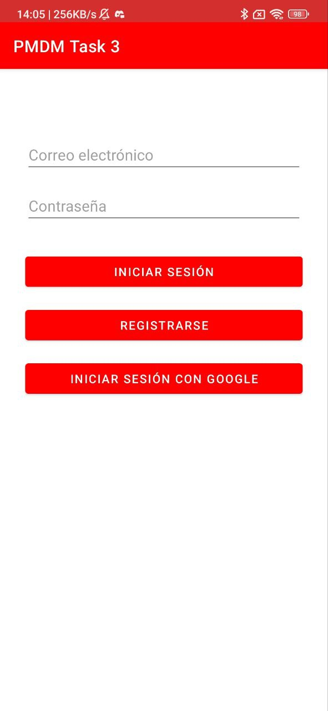
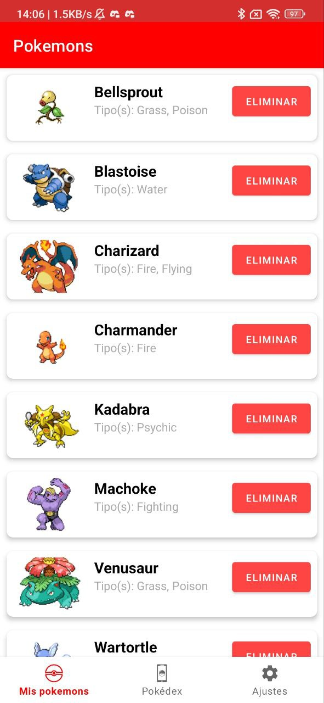
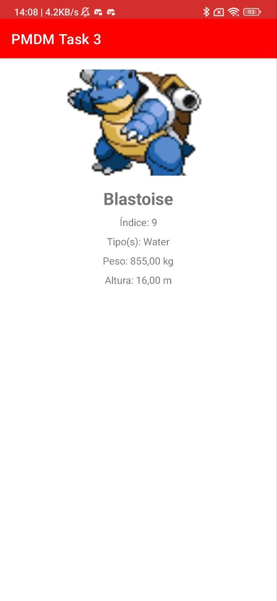

# Introducción

Esta aplicación es una Pokédex que permite a los usuarios registrar y gestionar sus Pokémon capturados. Utiliza la API de Pokémon para obtener información detallada sobre cada Pokémon y Firebase para la autenticación y almacenamiento de datos.

# Características principales

- **Autenticación**: Registro e inicio de sesión de usuarios utilizando Firebase Authentication.
- **Pokédex**: Visualización de una lista de todos los Pokémon disponibles.
- **Lista de Pokémon capturados**: Gestión y visualización de los Pokémon capturados por el usuario.
- **Ajustes**: Opciones para cambiar el idioma de la aplicación y eliminar Pokémon capturados.

# Tecnologías utilizadas

- **Firebase**: Para la autenticación y almacenamiento de datos.
- **Retrofit**: Para realizar solicitudes HTTP a la API de Pokémon.
- **Gson**: Para la conversión de JSON a objetos Java.
- **RecyclerView**: Para mostrar listas de datos de manera eficiente.
- **SwipeRefreshLayout**: Para implementar la funcionalidad de arrastrar para actualizar.
- **Apache Commons Lang**: Para utilidades adicionales de manipulación de cadenas.
- **AndroidX**: Conjunto de bibliotecas para el desarrollo de aplicaciones Android modernas.

# Instrucciones de uso

1. Clona el repositorio:
    ```bash
    git clone https://github.com/javierbentez/PMDM-Tarea-3.git
    ```
2. Abre el proyecto en Android Studio.
3. Instala las dependencias necesarias:
    - Firebase Authentication
    - Firebase Firestore
    - Retrofit
    - Gson
    - Play Services Auth
    - Apache Commons Lang
    - SwipeRefreshLayout
4. Configura Firebase en tu proyecto siguiendo [esta guía](https://firebase.google.com/docs/android/setup).
5. Ejecuta la aplicación en un dispositivo o emulador Android.

# Conclusiones

Durante el desarrollo de esta aplicación, enfrenté varios desafíos, como la integración de Firebase para la autenticación y el almacenamiento de datos, así como el uso de Retrofit para consumir la API de Pokémon. Aprendí mucho sobre la gestión de datos en tiempo real y la importancia de una arquitectura bien estructurada para mantener el código ordenado y entendible para cualquier persona ajena al proyecto.

# Capturas de pantalla



